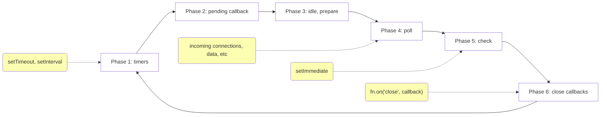

# Node.js Event Loop

## Facts

- The JavaScript part of Node.js is single-threaded
- `libuv` handles multi-threaded operations

## Phases

- Each Phase has a FIFO queue of callbacks to execute

## nextTickQueue & MicrotaskQueue

- `nextTick` callbacks go into `nextTickQueue`
- `nextTickQueue` is not a part of the event loop
- `nextTickQueue` will be processed when the current operation completed. An _operation_ is defined as a transition from the underlying C/C++ handler, and handling the JavaScript that needs to be executed.
- All callbacks within `nextTickQueue` resolved before the event loop continues.
- `Promise` callbacks go into `MicrotaskQueue`
- `nextTick` and Microtask queues can be used in all phases

## Reference

- [The Node.js Event Loop, Timers, and process.nextTick()](https://nodejs.org/en/docs/guides/event-loop-timers-and-nexttick/)
